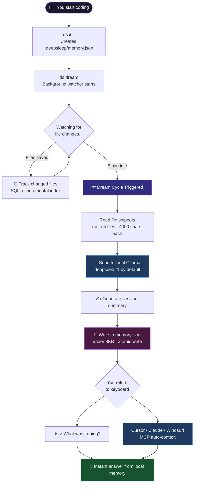
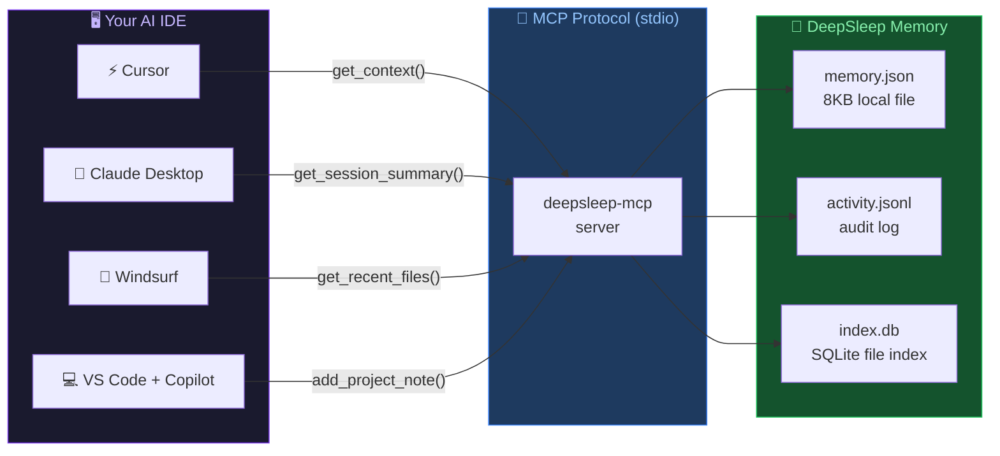
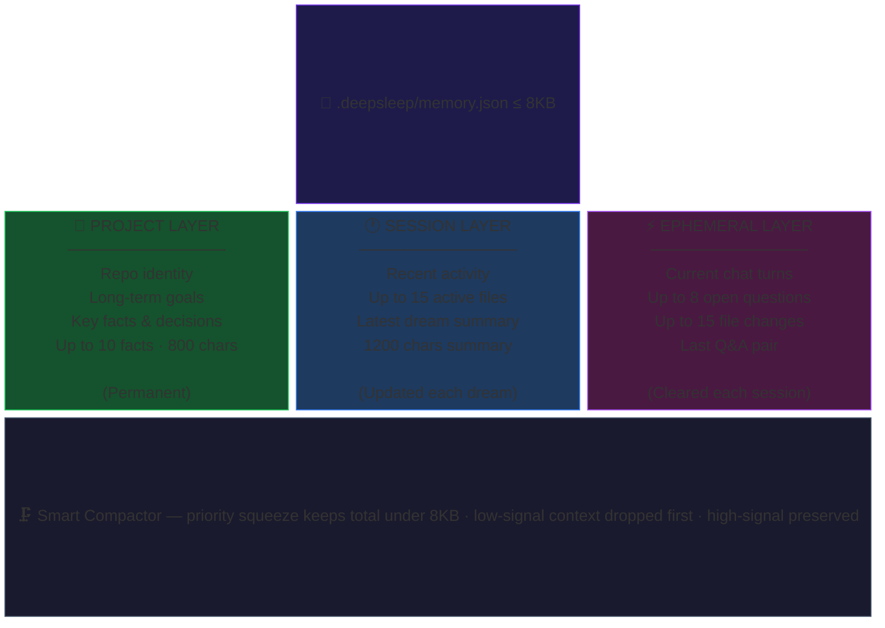
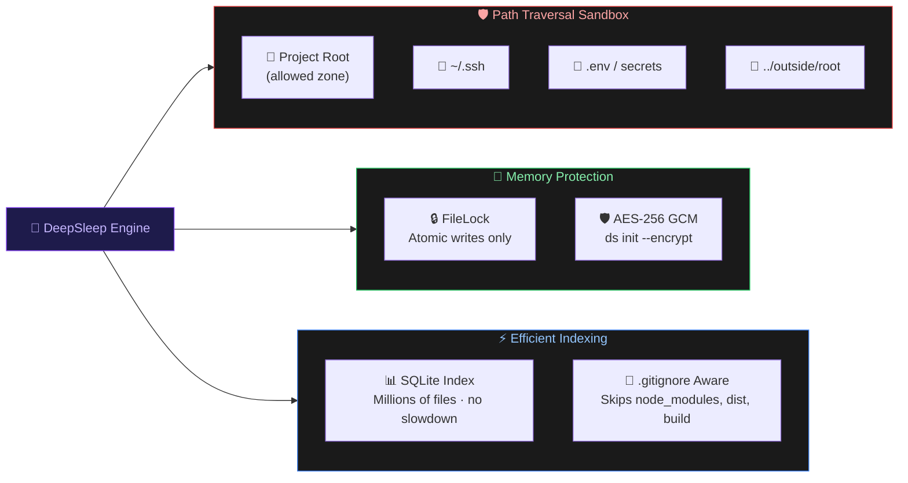
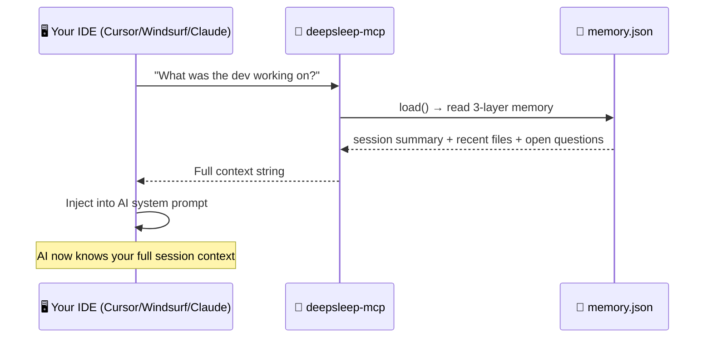
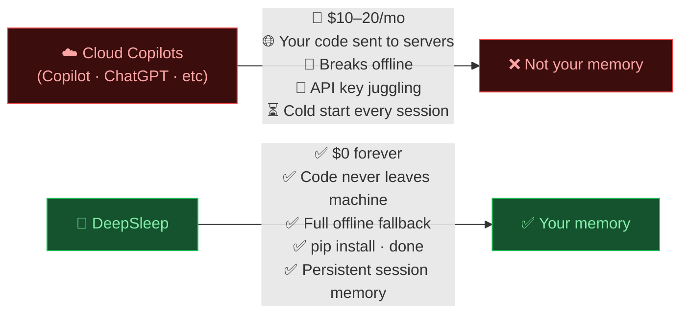

<div align="center">

# 🧠 DeepSleep

### Your codebase has a memory now.

*A zero-cost background agent that watches your files, dreams while you're away,*
*and answers "what was I working on?" — 100% local, no cloud, no subscriptions.*

[](https://pypi.org/project/deepsleep-ai/)
[](https://pypi.org/project/deepsleep-ai/)
[](https://github.com/Keshavsharma-code/DeepSleep-beta/actions/workflows/ci.yml)
[](./LICENSE)
[](https://pypi.org/project/deepsleep-ai/)
[](https://github.com/Keshavsharma-code/DeepSleep-beta/stargazers)
[](https://modelcontextprotocol.io)

<br>

<a href="https://www.producthunt.com/products/deepsleep-2?embed=true&utm_source=badge-featured&utm_medium=badge&utm_campaign=badge-deepsleep" target="_blank" rel="noopener noreferrer">
  
</a>

<br><br>


</div>

---

## The Problem

You take a coffee break. You come back. You stare at the screen.

**"Wait... what was I doing?"**

GitHub Copilot can't help you. ChatGPT doesn't know your codebase. Cursor has no idea what you were thinking. And scrolling through `git log` at 9am is not a vibe.

**DeepSleep fixes this.** It runs silently in the background, watches your files, and the moment you go idle — it *dreams*. It reads what changed, writes a compact session summary, and stores it locally. When you're back, just ask:

```bash
ds > What was I working on?
```

And with v0.2.0, your **Cursor / Claude Desktop / Windsurf** AI already knows — before you even open the terminal.

> **No cloud. No tokens burned. No subscription. Just memory.**

---

## How It Works



---

## v0.2.0 — MCP Server

> *The biggest DeepSleep release yet.*

DeepSleep now ships an official **[Model Context Protocol](https://modelcontextprotocol.io) (MCP) server**. Any MCP-compatible AI IDE can query your session memory natively — no copy-pasting, no manual context loading.



Open Cursor after a break and your AI already knows:

> *"You were debugging the JWT middleware 3 hours ago. You had `auth.ts` and `middleware.py` open. You were stuck on token validation and left an open question about refresh token expiry."*

Zero config. Zero copy-paste. Zero cloud.

---

## Memory Architecture

DeepSleep uses a **3-layer memory stack** — all stored in a single `.deepsleep/memory.json` file kept under **8KB**.



---

## Security Architecture



---

## Quickstart

### Step 1 — Install Ollama (one-time)

```bash
# macOS
brew install ollama

# Linux
curl -fsSL https://ollama.com/install.sh | sh

# Windows
# Download from https://ollama.com/download/windows
```

```bash
# Start Ollama and pull the model
ollama serve
ollama pull deepseek-r1
```

> **Don't have Ollama?** DeepSleep still works — it falls back to its local memory snapshot and gives you deterministic answers. Ollama just makes them smarter.

### Step 2 — Install DeepSleep

```bash
# Terminal only (no MCP)
pip install deepsleep-ai

# With MCP server (for Cursor, Claude Desktop, Windsurf)
pip install 'deepsleep-ai[mcp]'
```

### Step 3 — Initialize your project

```bash
cd your-project/
ds init

# Optional: password-protected memory (AES-256)
ds init --encrypt
```

### Step 4 — Start the background watcher

```bash
ds dream
# DeepSleep is now watching. Go code. Come back. It remembered.
```

### Step 5 — Ask it anything

```bash
ds
> What was I working on?
> What files did I touch today?
> What's the next thing I should do?
> Summarize my last session
> What open questions do I have?
```

> **One-liner demo:**
> ```bash
> pip install deepsleep-ai && ollama pull deepseek-r1 && ds init && ds dream --once && ds
> ```

---

## MCP Server — Full Setup Guide

### What is MCP?

[Model Context Protocol](https://modelcontextprotocol.io) is an open standard that lets AI IDEs (Cursor, Claude Desktop, Windsurf, VS Code Copilot) pull context from external tools. DeepSleep's MCP server makes your session memory available to any of these IDEs automatically.



### Install

```bash
pip install 'deepsleep-ai[mcp]'
```

### Configure Claude Desktop

Edit `~/.claude/config.json` (create it if it doesn't exist):

```json
{
  "mcpServers": {
    "deepsleep": {
      "command": "deepsleep-mcp",
      "args": ["--path", "/absolute/path/to/your/project"]
    }
  }
}
```

Restart Claude Desktop. That's it. Your AI now has memory.

### Configure Cursor

Create `.cursor/mcp.json` in your project root (or edit global Cursor settings):

```json
{
  "mcpServers": {
    "deepsleep": {
      "command": "deepsleep-mcp",
      "args": ["--path", "/absolute/path/to/your/project"]
    }
  }
}
```

Or via **Cursor Settings → MCP → Add Server**.

### Configure Windsurf

Edit `~/.codeium/windsurf/mcp_config.json`:

```json
{
  "mcpServers": {
    "deepsleep": {
      "command": "deepsleep-mcp",
      "args": ["--path", "/absolute/path/to/your/project"]
    }
  }
}
```

### Manual / Terminal

```bash
# Start the server manually
ds mcp /path/to/your/project

# Or use the standalone entry point directly
deepsleep-mcp --path /path/to/your/project
```

### Available MCP Tools

| Tool | Description |
|------|-------------|
| `get_context` | **Primary tool** — full 3-layer memory. Call this first. |
| `get_session_summary` | Latest AI-generated dream summary + timestamp |
| `get_recent_files` | List of recently modified/accessed files |
| `get_status` | Project status dict (path, memory size, last dream, model) |
| `get_activity_log` | Filtered activity entries (supports `since`, `limit`, `event_type`) |
| `get_open_questions` | Unresolved questions from the current session |
| `get_project_facts` | Long-term project summary, goals, facts |
| `record_file_opened` | Tell DeepSleep a file was opened in the IDE |
| `add_project_note` | Save a factual note to long-term memory |

---

## Commands Reference

| Command | What it does |
|---------|--------------|
| `ds init` | Initialize memory brain for your project |
| `ds init --encrypt` | Same, with AES-256 GCM password protection |
| `ds` | Open the interactive chat interface |
| `ds chat` | Alias for `ds` |
| `ds dream` | Start the background file watcher (runs forever) |
| `ds dream --once` | Run one dream cycle immediately and exit |
| `ds status` | Inspect current memory snapshot |
| `ds export` | Export activity log as Markdown standup report |
| `ds export --format json` | Export as JSON |
| `ds forget --layer session` | Wipe the session layer |
| `ds forget --all` | Full memory reset (with confirmation) |
| `ds doctor` | Quick health check — Ollama, disk, encryption |
| `ds health` | Detailed system check with JSON output option |
| `ds mcp [path]` | Start MCP server (for Cursor, Claude Desktop, Windsurf) |
| `deepsleep-mcp --path /p` | Standalone MCP entry point for IDE config files |

---

## Why Local-First?



---

## Feature Overview

| Feature | Detail |
|---------|--------|
| 🔌 **MCP Server** | Native integration with Cursor, Claude Desktop, Windsurf |
| 🧠 **8KB Memory** | 4× larger than v0.1 — retains far more session context |
| 📂 **5-file context** | Reads up to 5 files · 4,000 chars each per chat query |
| 💤 **Idle Dreaming** | Auto-summarizes your session after 5 min idle |
| 🔒 **Atomic Writes** | FileLock + temp-then-rename — zero memory corruption |
| 🛡️ **Path Sandbox** | Locked to project root — `.ssh`, `.env` never touch the model |
| 🗂️ **Gitignore-Aware** | Skips `node_modules`, `dist`, build artifacts automatically |
| ⚡ **SQLite Index** | Handles millions of files with no slowdown |
| 🔐 **AES-256 Encryption** | Optional password-protected memory at rest |
| 📴 **Offline Fallback** | Works without Ollama — answers from saved local memory |
| 🪟 **Windows Support** | Forward-slash path normalization, thread-safe SQLite |
| 📊 **Activity Log** | Immutable `activity.jsonl` audit trail across all sessions |

---

## Troubleshooting

### Ollama issues

| Error | Fix |
|-------|-----|
| `Ollama is not running` | Run `ollama serve` in a terminal tab and keep it open |
| `model not found` | Run `ollama pull deepseek-r1` |
| `Connection refused` | Check Ollama is on `http://127.0.0.1:11434` — run `ds health` |
| `Empty response` | Try a smaller model: `ds --model phi3` |
| Slow answers | Normal for first call — model is loading. Subsequent calls are fast. |

```bash
# Full Ollama setup check
ds doctor

# Detailed JSON health report
ds health --format json
```

### Memory issues

| Error | Fix |
|-------|-----|
| `Memory is busy` | Another `ds` process is running — wait 3 seconds and retry |
| `Invalid password` | Wrong password for encrypted memory — there is no recovery without the password |
| `Garbage answers` | Type `/memory` in chat to inspect memory; use `ds forget` to selectively clear |
| Memory looks stale | Run `ds dream --once` to force a fresh summary |

```bash
# Inspect what DeepSleep knows
ds
> /memory

# Selectively wipe stale data
ds forget --layer session
ds forget --layer ephemeral

# Nuclear option (with confirmation prompt)
ds forget --all
```

### MCP issues

| Error | Fix |
|-------|-----|
| `command not found: deepsleep-mcp` | Run `pip install 'deepsleep-ai[mcp]'` |
| `mcp package not installed` | Run `pip install mcp` or `pip install 'deepsleep-ai[mcp]'` |
| IDE doesn't pick up context | Make sure `--path` in config points to the **exact** project root |
| MCP server crashes on start | Run `deepsleep-mcp --path /your/project` in terminal to see the error |
| Context is empty / outdated | Run `ds dream --once` in your project to refresh the session summary |

```bash
# Verify the MCP server works before wiring it to an IDE
deepsleep-mcp --path /path/to/your/project
# Should print: "DeepSleep MCP server starting for ..." and then block (that's correct)
```

### Windows issues

| Issue | Fix |
|-------|-----|
| Watcher misses file changes | Use `watchdog` polling backend: `set WATCHDOG_OBSERVER_IMPL=polling` |
| Permission denied on `.deepsleep/` | Run terminal as Administrator once to create the folder, then it works normally |
| Paths look wrong in memory | Update to v0.2.0+ — paths are now normalized to forward slashes |

---

## Package Layout

```
src/deepsleep_ai/
├── cli.py             # Typer CLI + Prompt Toolkit interactive chat
├── mcp_server.py      # MCP server — Cursor, Claude Desktop, Windsurf
├── watcher.py         # Watchdog idle watcher + dream loop + SQLite index
├── memory_manager.py  # 3-layer memory · 8KB compactor · AES-256 encryption
├── llm_client.py      # Ollama connector + deterministic offline fallback
└── config.py          # Pydantic-settings configuration

tests/
├── test_cli.py
├── test_concurrency.py
├── test_doctor.py
├── test_encryption.py
├── test_export.py
├── test_forget.py
├── test_llm_client.py
├── test_memory_manager.py
├── test_security.py
└── test_watcher.py
```

---

## Contributing

1. Check [ROADMAP.md](./ROADMAP.md) for what's being built
2. Read [CONTRIBUTING.md](./CONTRIBUTING.md) for setup
3. Open an issue or send a PR — reviewed fast

```bash
# Local dev setup (includes MCP server)
python3 -m venv .venv && source .venv/bin/activate
pip install -e ".[dev]"
pytest -v
```

---

## Ecosystem

| Project | What it is |
|---------|------------|
| **[DeepSleep-beta](https://github.com/Keshavsharma-code/DeepSleep-beta)** (you are here) | Python CLI + MCP server · local coding memory |
| **[DeepSleep-Hub](https://github.com/Keshavsharma-code/deepsleep-hub)** | Browser extension · ChatGPT, Claude & Gemini neural bridge with 3D Visual Cortex |

---

## Trust Signals

- Live on PyPI: [`pip install deepsleep-ai`](https://pypi.org/project/deepsleep-ai/)
- MIT licensed — use it in anything
- GitHub Actions CI on every push
- 10 test modules covering memory, encryption, concurrency, watcher, chat, doctor
- Atomic memory writes — zero corruption risk
- `ds` + `deepsleep-mcp` console entry points — work immediately after install
- No telemetry. No analytics. No network calls except to your local Ollama.

---

<div align="center">

**If DeepSleep remembered something you forgot, give it a ⭐**

*Built for developers who actually forget things — which is all of us*

</div>
