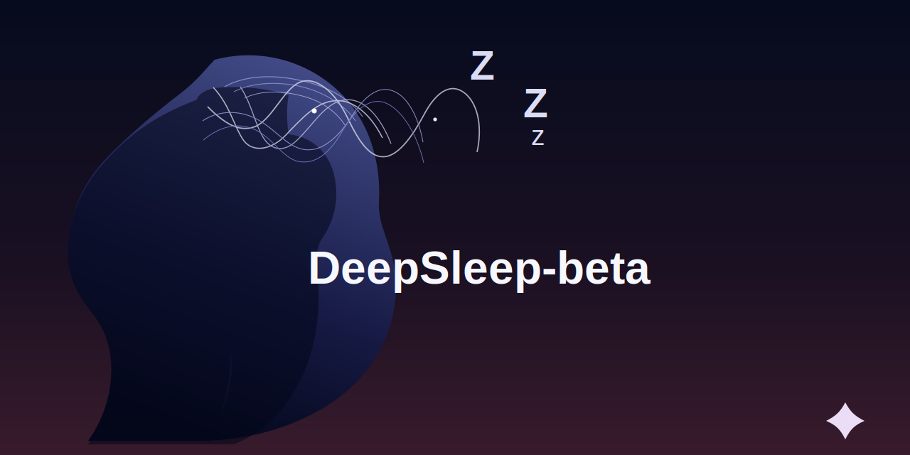

# DeepSleep-bets

[](https://pypi.org/project/deepsleep-ai/)
[](https://pypi.org/project/deepsleep-ai/)
[](https://github.com/Keshavsharma-code/DeepSleep-beta/actions/workflows/ci.yml)
[](./LICENSE)



DeepSleep is the open-source background agent for local models.

It gives developers a `ds` workflow, a compact 3-layer memory file, and idle-time "dreaming" that summarizes recent work while they are away.

It is positioned for developers looking for an open-source AI coding agent, a local-LLM developer tool, a terminal copilot, or a Claude Code alternative that runs on Ollama instead of a hosted API.

It is written from scratch and safe to publish. The architecture is inspired by the broader always-on agent pattern, not copied from leaked source code or source maps.

## Why it lands fast

- `pip install deepsleep-ai`
- `ds init`
- `ds`
- `ds dream`

That is the product.

You initialize a repo once, ask natural questions in the terminal, and let DeepSleep update session context after you stop typing.

## Core promise

- `Zero-cost agent`: runs on local Ollama models instead of paid tokens
- `Idle-time dreaming`: watches your repo and summarizes after inactivity
- `3-layer memory`: `project`, `session`, and `ephemeral`
- `Terminal-native`: hacker-style interactive UI with file completion

## Search-friendly positioning

DeepSleep is best described as:

- an open-source AI coding agent
- a local AI developer tool
- a background agent for codebases
- a terminal copilot for Ollama
- a local-model alternative to hosted coding assistants

If people are searching for phrases like `open source claude code alternative`, `local ai coding agent`, `ollama coding assistant`, or `background agent for developers`, this is the category DeepSleep belongs in.

## Quick demo

```bash
pip install deepsleep-ai
ollama pull deepseek-r1
ds init
ds dream --once
ds
```

Then ask:

```text
What was I doing?
Refactor src/deepsleep_ai/cli.py
Summarize the recent changes
```

## 3-layer memory architecture

DeepSleep explicitly implements a 3-layer memory stack:

- `project`: long-term repo identity, goals, and facts
- `session`: what you were doing recently, which files were active, and the latest dream summary
- `ephemeral`: last turns, open questions, and the most recent file changes

All of it lives in `.deepsleep/memory.json`, and the compactor keeps that file under `2KB` so it stays fast, deterministic, and portable.

## Zero-cost local model stack

DeepSleep is built for [Ollama](https://ollama.com/) and targets `deepseek-r1` by default.

If Ollama is offline, DeepSleep still works with deterministic local fallbacks so demos do not collapse and the tool remains usable on day one.

## Idle-time dreaming

Run `ds dream`, leave your editor open, and DeepSleep watches your project for file saves.

After `5 minutes` of inactivity, it:

1. collects the files you touched
2. reads compact local snippets
3. writes a fresh session summary into memory
4. preserves only the highest-signal context under the 2KB cap

That is what makes `What was I doing?` feel instant the next time you open the project.

## Install

### PyPI

```bash
pip install deepsleep-ai
```

Quick check:

```bash
ds --version
ds doctor
```

### Local development

```bash
python3 -m venv .venv
source .venv/bin/activate
pip install -e ".[dev]"
```

### Ollama

```bash
ollama serve
ollama pull deepseek-r1
```

## Commands

```bash
ds init
ds
ds chat
ds dream
ds dream --idle-seconds 300
ds status
ds doctor
```

## Why it feels real

- installs directly from PyPI
- keeps memory deterministic and compact
- works with local models through Ollama
- degrades gracefully when Ollama is offline
- ships CI, tests, and a release workflow

## First-run workflow

### 1. Initialize a project

```bash
ds init
```

This creates:

- `.deepsleep/memory.json`
- `.deepsleep/activity.jsonl`
- `.deepsleep/prompt_history.txt`

### 2. Validate your setup

```bash
ds doctor
```

It checks the memory files, Ollama reachability, and whether your chosen model is available.

### 3. Start the interactive UI

```bash
ds
```

Inside the prompt you can ask:

- `What was I doing?`
- `Refactor src/deepsleep_ai/cli.py`
- `Summarize the recent changes`

Slash commands:

- `/help`
- `/status`
- `/memory`
- `/dream`
- `/quit`

### 4. Start the dream loop

```bash
ds dream
```

DeepSleep watches the current project with Watchdog and writes fresh session context after idle periods.

### 5. One-shot demo mode

```bash
ds dream --once
```

This is great for screenshots, demos, and launch videos because it snapshots recently touched files even if the watcher was not already running.

## Package layout

The MVP is centered on these four files:

- [`cli.py`](./src/deepsleep_ai/cli.py): Typer entrypoint and Prompt Toolkit UI
- [`watcher.py`](./src/deepsleep_ai/watcher.py): Watchdog-based idle watcher and dream loop
- [`memory_manager.py`](./src/deepsleep_ai/memory_manager.py): layered memory store with 2KB compaction
- [`llm_client.py`](./src/deepsleep_ai/llm_client.py): Ollama connector with safe local fallback

## Trust signals

- publishable `pyproject.toml` for `pip install deepsleep-ai`
- `ds` console entrypoint
- MIT license
- GitHub Actions CI
- tests for memory compaction, watcher behavior, offline fallback, and chat exit flow
- live PyPI package: [deepsleep-ai](https://pypi.org/project/deepsleep-ai/)

## Self-test

```bash
pytest -q
python -m deepsleep_ai --help
python -m build --no-isolation
```

## Launch kit

If you want this repo to travel, keep the demo brutally simple:

1. `ds init`
2. edit two files
3. `ds dream --once`
4. show `.deepsleep/memory.json`
5. ask `What was I doing?`
6. run `ds doctor`

That story is short, visual, and immediately understandable.

There is a practical launch playbook in [`LAUNCH.md`](./LAUNCH.md), a contributor guide in [`CONTRIBUTING.md`](./CONTRIBUTING.md), release instructions in [`RELEASING.md`](./RELEASING.md), and a project history in [`CHANGELOG.md`](./CHANGELOG.md).
