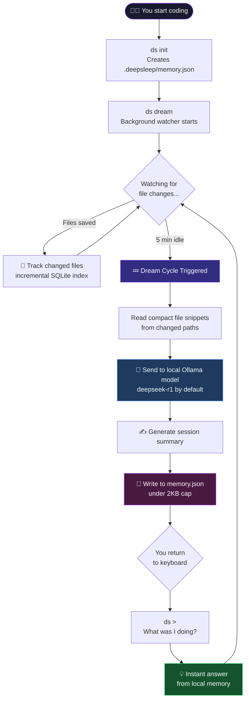
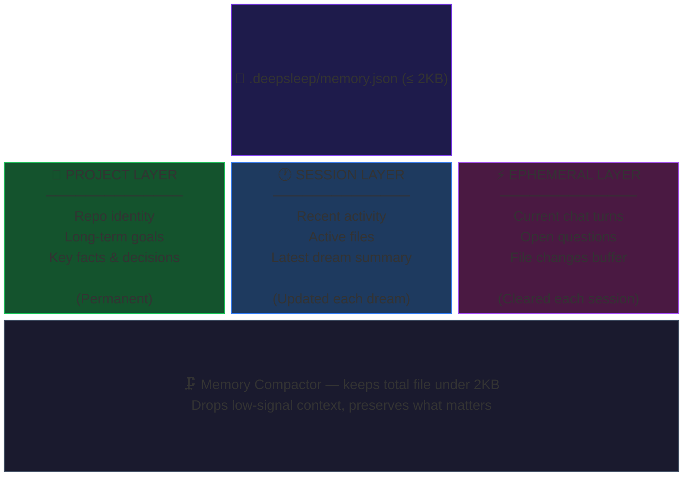
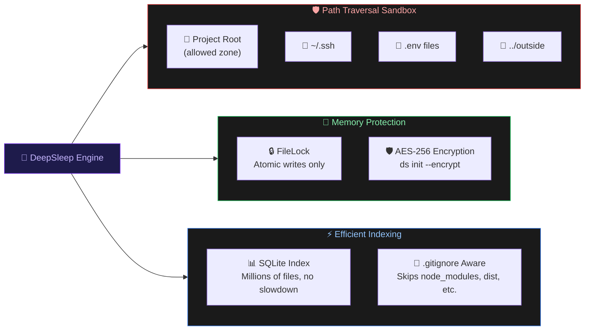
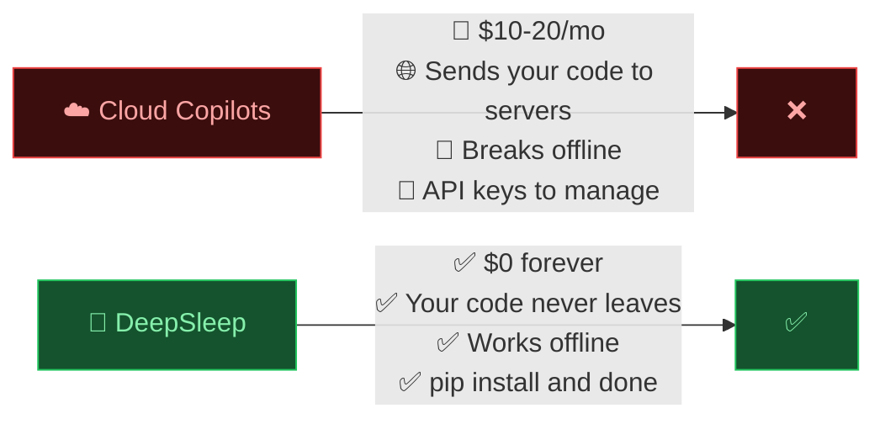

<div align="center">

# 🧠 DeepSleep

### Your codebase has a memory now.

*A zero-cost background agent that watches your files, dreams while you're away, and answers "what was I doing?" — 100% local, no subscriptions, no cloud.*

[](https://pypi.org/project/deepsleep-ai/)
[](https://pypi.org/project/deepsleep-ai/)
[](https://github.com/Keshavsharma-code/DeepSleep-beta/actions/workflows/ci.yml)
[](./LICENSE)
[](https://pypi.org/project/deepsleep-ai/)
[](https://github.com/Keshavsharma-code/DeepSleep-beta/stargazers)

<br>

<a href="https://www.producthunt.com/products/deepsleep-2?embed=true&utm_source=badge-featured&utm_medium=badge&utm_campaign=badge-deepsleep" target="_blank" rel="noopener noreferrer">
  
</a>

<br><br>


</div>

---

## The Problem

You take a coffee break. You come back. You stare at the screen.

**"Wait... what was I doing?"**

GitHub Copilot can't help you. ChatGPT doesn't know your codebase. And scrolling through git log at 9am is not a vibe.

**DeepSleep fixes this.** It runs silently in the background, watches your files, and the moment you go idle — it *dreams*. It reads what changed, writes a compact summary, and stores it locally. When you're back, just ask:

```bash
ds > What was I working on?
```

That's it. No cloud. No tokens burned. No subscription.

---

## How It Works



---

## Memory Architecture

DeepSleep uses a **3-layer memory stack** — all stored in a single `.deepsleep/memory.json` file kept under **2KB**.



---

## Security Architecture



---

## Quickstart

```bash
# 1. Install
pip install deepsleep-ai

# 2. Make sure Ollama is running
ollama serve
ollama pull deepseek-r1

# 3. Initialize your project brain
cd your-project/
ds init

# 4. Start the background watcher
ds dream

# 5. Come back later and just ask
ds
> What was I working on?
> What files did I touch today?
> What's the next thing I should do?
```

> **One-liner demo:**
> ```bash
> pip install deepsleep-ai && ollama pull deepseek-r1 && ds init && ds dream --once && ds
> ```

---

## Commands

| Command | What it does |
|---|---|
| `ds init` | Initialize a memory brain for your project |
| `ds init --encrypt` | Same, but password-protected (AES-256) |
| `ds` | Open the chat interface |
| `ds chat` | Alias for `ds` |
| `ds dream` | Start the background file watcher |
| `ds dream --once` | Run one dream cycle immediately |
| `ds status` | Inspect what's in memory |
| `ds health` | Verify Ollama + DeepSleep setup |

---

## v1.0 Production Features

| Feature | Detail |
|---|---|
| 🔒 **Atomic Security** | `FileLock` prevents memory corruption across concurrent instances |
| 🛡️ **Path Sandbox** | Locked to project root — can never leak `.ssh` or `.env` to the model |
| 📂 **Gitignore-Aware** | Respects `.gitignore` — skips `node_modules`, `dist`, build artifacts |
| ⚡ **Incremental Indexing** | SQLite-based tracker handles millions of files instantly |
| 🔐 **At-Rest Encryption** | Optional AES-256 password protection via `ds init --encrypt` |
| 📝 **Structured Logging** | `structlog` integration + `ds health` for clean observability |
| 📴 **Offline Fallback** | Deterministic local fallbacks when Ollama is unavailable |

---

## Why Local-First?



No tokens. No subscriptions. No code leaves your machine. Ever.

---

## Ecosystem

| Project | What it is |
|---|---|
| **[DeepSleep-beta](https://github.com/Keshavsharma-code/DeepSleep-beta)** (you are here) | Python CLI background agent |
| **[DeepSleep-Hub](https://github.com/Keshavsharma-code/deepsleep-hub)** | Browser extension — universal neural bridge for ChatGPT, Claude & Gemini with 3D Visual Cortex |

---

## Troubleshooting

| Error | Fix |
|---|---|
| `"Ollama not found"` | Install [Ollama](https://ollama.com/), run `ollama serve`, then retry |
| `"Permission Denied"` | DeepSleep needs write access to the current folder |
| `"Stuck dreaming"` | Save some files — it only dreams after actual file changes |
| `"Garbage answers"` | Type `/memory` to inspect what it knows; correct it directly in chat |

---

## Package Layout

```
src/deepsleep_ai/
├── cli.py             # Typer entrypoint + Prompt Toolkit chat UI
├── watcher.py         # Watchdog-based idle watcher + dream loop
├── memory_manager.py  # 3-layer memory store with 2KB compactor
├── llm_client.py      # Ollama connector + offline fallback
└── config.py          # Pydantic-powered configuration
```

---

## Contributing

1. Check [ROADMAP.md](./ROADMAP.md) for what's being built
2. Read [CONTRIBUTING.md](./CONTRIBUTING.md) for setup
3. Open an issue or send a PR — we review fast

```bash
# Local dev setup
python3 -m venv .venv && source .venv/bin/activate
pip install -e ".[dev]"
pytest -v
```

---

## Trust Signals

- Live on PyPI: [`pip install deepsleep-ai`](https://pypi.org/project/deepsleep-ai/)
- MIT licensed
- GitHub Actions CI on every push
- Tests cover: memory compaction, watcher behavior, offline fallback, chat exit flow
- `ds` console entrypoint — works right after install

---

<div align="center">

**If DeepSleep saved your brain at least once, give it a ⭐**

*Made for developers who actually forget things (all of us)*

</div>